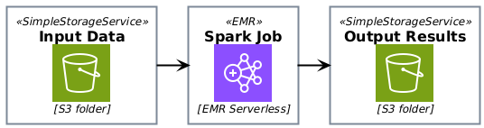
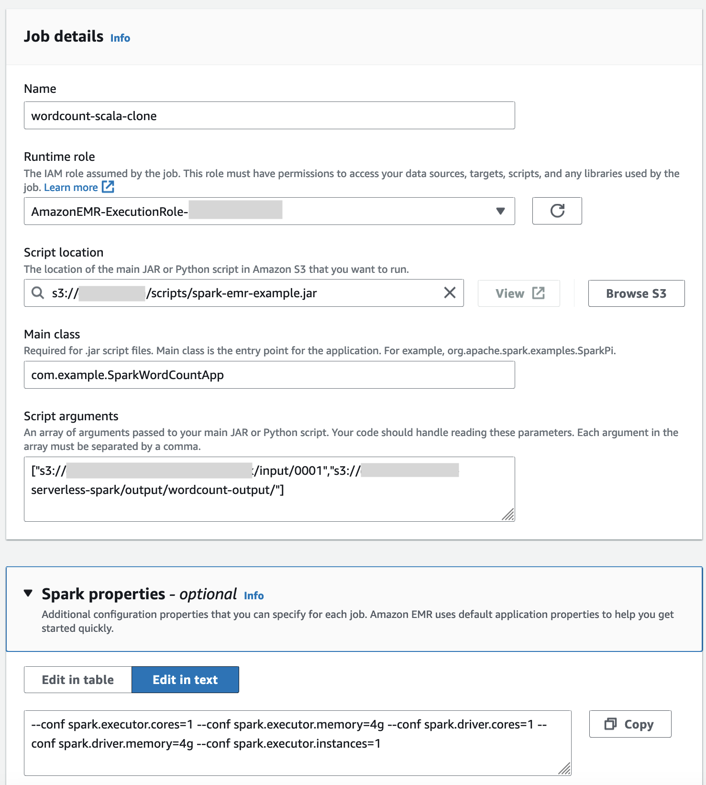
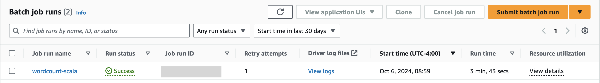
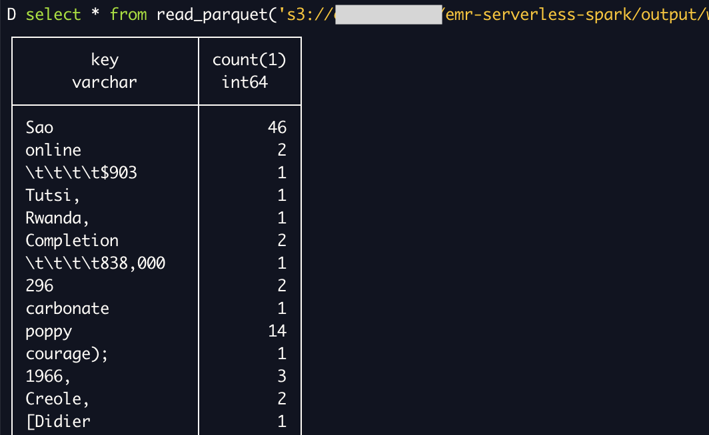

# AWS Elastic Map Reduce (EMR) Spark Job Example
The project is an example of a word count batch processing problem that runs as a Spark job on AWS EMR.

The project requires Java 17, Scala 2.12 and sbt 1.8.2+ environment to build. Scala 2.12 is requires since AWS EMR support only Scala 2.12 as of Oct 2024.

## Project Details
For detailed instructions of setting up Spark on EMR Serverless see https://docs.aws.amazon.com/emr/latest/EMR-Serverless-UserGuide/getting-started.html. The instructions below in this readme summarize the key steps needed to run EMR jobs.

### Architecture
The overall architecture is described in the diagram below. The input and output files are in S3, a distributed file system. The batch processing job runs on EMR Serverless which automatically provisions and scales the number of machines and nodes needed in the Spark cluster to run the job. Spark job parameters can be used to provide fine grained control on the master and worker nodes CPU and memory resources.

[](./docs/emr-arch.png)


### Step 1: Building the job code
In the root folder,
- Compile the code with `sbt compile`

  Verify the code compiles without any errors

- Run the unit tests with `sbt test`

  Verify all tests pass

- Create an uberjar with `sbt assembly`

  Verify a single jar containing the job code and its dependencies is produced at `target/scala-2.12/spark-emr-example.jar`

### Step 2: Preparing the Infrastructure
1. Create EMR Studio Workspace
2. Create a Serverless Application with defaults
3. Create an IAM role to execute the job
4. Create S3 buckets and folders for data and program files
5. Upload data and program files to S3
The simplest option to copy files to S3 is to use the AWS CLI tool.
  1. Export AWS_PROFILE to use
  ```
  export AWS_PROFILE=<my-aws-profile>
  ```
  2. Copy files using AWS CLI
  ```
  aws s3 cp <local-data-file> s3://<bucket-name>/<folder-name>/<file-name>
  ```

### Step 3: Submitting the batch job
Create a spark job specifying:
- input arguemnts: `["s3://emr-bucket/inputpath","s3://emr-bucket/outputpath"]`
- main class: `com.example.SparkWordCountApp`
- job spark parameters: `--conf spark.executor.cores=1 --conf spark.executor.memory=4g --conf spark.driver.cores=1 --conf spark.driver.memory=4g --conf spark.executor.instances=1`

[](./docs/job-properties.png)

The job should start running. After a few minutes the job should complete with a success status.

[](./docs/job-status.png)

### Step 4: Verifying the output
By default results are written as parquet files. Use a parquet file viewer like DuckDB to verify results.

[](./docs/job-results.png)

**Have fun!**

## License
Copyright 2024, Edward Sumitra

Licensed under the MIT License.
